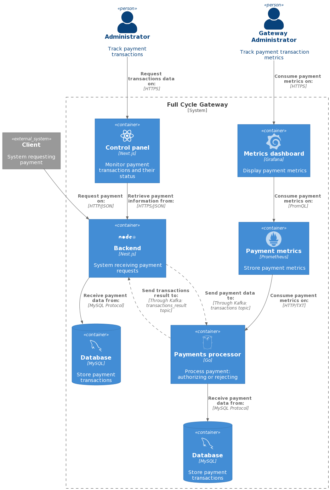

# Imersão Fullcycle 5 - Payment Gateway

## Repository info

This repository contains the source code developed during the "Imersão Fullcycle 5" regarding the basic concepts of microservices such as assynchronus communication, containers, metrics and observability.

Installation instructions can be found in the README.md file of each project.

## Technologies used:

- [Golang][golang]
- [Nestjs][nestjs]
- [Nextjs][nextjs]
- [Kafka][kafka]
- [Docker][docker]
- [Kubernetes][kubernetes]
- [Mysql][mysql]

## Recommended order of execution

* Apache Kafka
* Golang
* Back-end Nest.js
* Front-end Next.js

## C4 diagram of the solution

---
Made by Jeison de Borba :wave: [Get in touch!](https://www.linkedin.com/in/jeison-de-borba/)

[golang]: https://go.dev/
[nestjs]: https://nestjs.com/
[nextjs]: https://nextjs.org/
[kafka]: https://kafka.apache.org/
[docker]: https://www.docker.com/
[kubernetes]: https://kubernetes.io/
[mysql]: https://bitnami.com/stack/mysql
